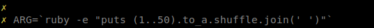
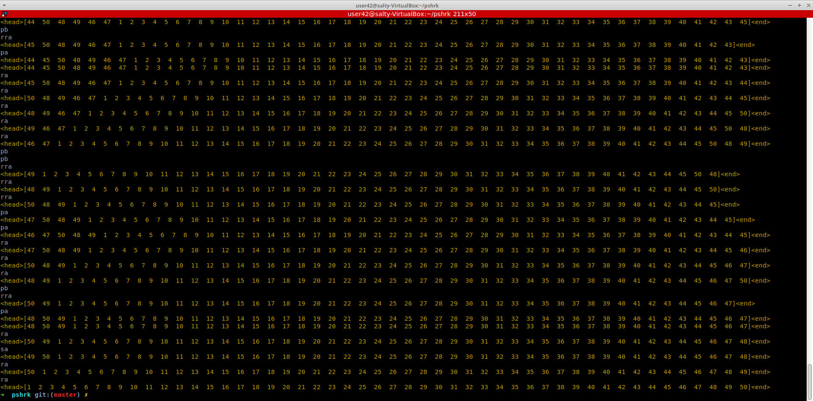

# push_swap
 Skills
Imperative programming
Unix
Rigor
Algorithms & AI 

Summary: This project asks you to sort data on a stack, with a limited set of instructions, in as few moves as possible.
To succeed, you will have to manipulate different sorting algorithms and choose the most appropriate solution For an optimized classification of the data.

Sorting values is simple. To sort them the fastest way possible is less simple, especially
because from one integers configuration to another, the most efficient sorting algorithm
can differ.

Execution:

Create a parameter of 200 different integers sorted randomly: ARG=`ruby -e "puts (1..200).to_a.shuffle.join(' ')"`

Execute push_swap program with or without -v option to print the stack throughout the sorting: ./push_swap -v $ARG

The game is composed of 2 stacks named a and b.
• To start with:
 a contains a random number of either positive or negative numbers without
any duplicates.
 b is empty
 
 __________________________________________________________________________________________________________________________________
 
The goal is to sort in ascending order numbers into stack a.

To do this you have the following operations at your disposal:

sa : swap a - swap the first 2 elements at the top of stack a. Do nothing if there
is only one or no elements).

sb : swap b - swap the first 2 elements at the top of stack b. Do nothing if there
is only one or no elements).

ss : sa and sb at the same time.

pa : push a - take the first element at the top of b and put it at the top of a. Do
nothing if b is empty.

pb : push b - take the first element at the top of a and put it at the top of b. Do
nothing if a is empty.

ra : rotate a - shift up all elements of stack a by 1. The first element becomes
the last one.

rb : rotate b - shift up all elements of stack b by 1. The first element becomes
the last one.

rr : ra and rb at the same time.

rra : reverse rotate a - shift down all elements of stack a by 1. The last element
becomes the first one.

rrb : reverse rotate b - shift down all elements of stack b by 1. The last element
becomes the first one.

rrr : rra and rrb at the same time

